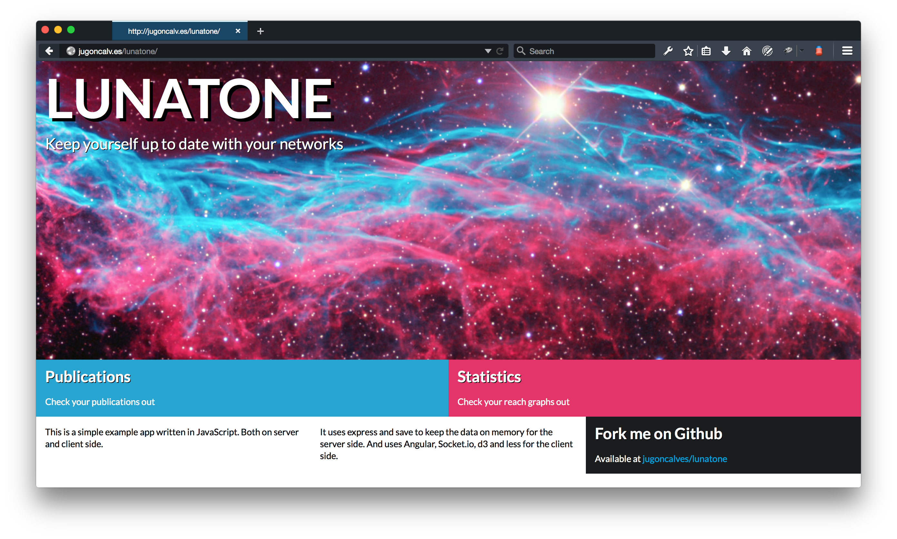

Lunatone
---

Example app using node.js, angular, socketio and d3.

Screenshots
===




Usage
===

Install [cleancss](https://www.npmjs.com/package/clean-css), [lessc](https://www.npmjs.com/package/less) and [less-plugin-semantic-ui](https://github.com/bassjobsen/less-plugin-semantic-ui/) globally if you'd like to change any css file.

```bash
$ npm install
$ node app.js
```

The app should be available at [http://localhost:3000/](http://localhost:3000/).

License
===

MIT
